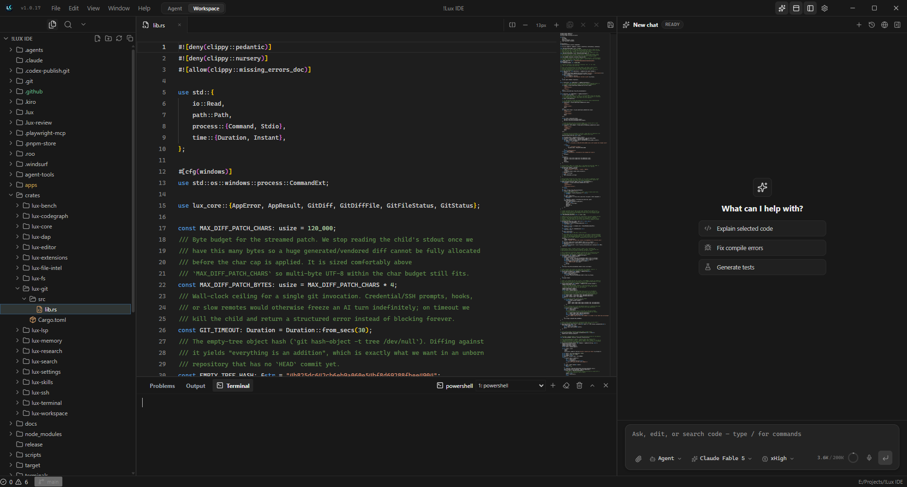
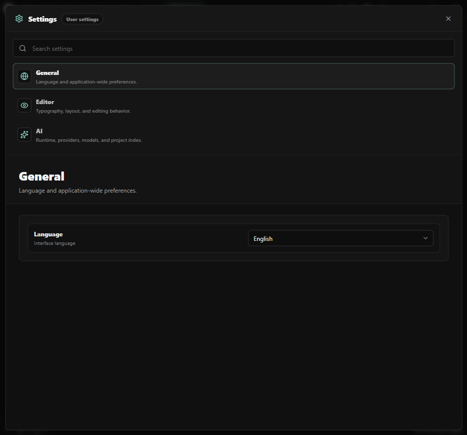

<p align="center">
  
</p>

<h1 align="center">Lux IDE</h1>

<p align="center">
  <b>The AI-native desktop IDE with a Rust engine.</b><br>
  Autonomous coding agent, parallel subagents, code graph, project memory, web research — built into a fast, polished editor.
</p>

<p align="center">
  <a href="https://github.com/GofMan5/lux-ide/releases/latest"></a>
  <a href="https://github.com/GofMan5/lux-ide/releases"></a>
  <a href="https://github.com/GofMan5/lux-ide/actions/workflows/ci.yml"></a>
  <a href="LICENSE"></a>
  <a href="https://github.com/GofMan5/lux-ide/stargazers"></a>
</p>

<p align="center">
  
  
  
  
  
</p>

<p align="center">
  <a href="https://github.com/GofMan5/lux-ide/releases/latest"><b>⬇ Download for Windows</b></a>
  ·
  <a href="#-features">Features</a>
  ·
  <a href="#-the-ai-agent">AI Agent</a>
  ·
  <a href="#%EF%B8%8F-architecture">Architecture</a>
  ·
  <a href="#-support-the-project">Donate</a>
  ·
  <a href="https://t.me/lux_ide">Telegram</a>
</p>

---


**Lux IDE** is an open-source, Cursor-class desktop IDE where the heavy lifting — filesystem, search, Git, LSP, terminal PTY, the entire AI agent loop — runs in **native Rust**, and a **React + Monaco** workbench delivers the UI. No Electron. No browser-only shell. The AI isn't a sidebar plugin: it is a first-class product surface that can inspect, edit, verify, and ship changes in your project.

> ⚡ Auto-updates included — install once, every release lands automatically.

## ✨ Why Lux

| | Lux IDE |
|---|---|
| 🦀 **Rust-first engine** | Workspaces, FS mutations, search, Git, LSP, PTY, settings, and the agent runtime are native Rust crates — fast and memory-safe |
| 🤖 **Real autonomous agent** | Plan mode, tool approval gates, checkpoints & rollback, parallel subagents, live terminal mirror of everything the agent runs |
| 🧠 **Project intelligence** | Tree-sitter **code graph** (definitions, callers, impact), per-project **SQLite memory**, discoverable **skills**, semantic context budgeting |
| 🌐 **Built-in web research** | Multi-query research engine with reranking, passage citations, and consensus across sources — no stale model knowledge |
| 🔌 **Any AI provider** | Anthropic, OpenAI, and ~30 preset providers via OpenAI-compatible or Anthropic protocol; prompt caching and streaming built in |
| 🔒 **Local & private** | Zero listening ports by default, approval gates for dangerous tools, secrets redaction, your code stays on your machine |

## 🚀 Features

### Editor & Workbench
- **Monaco editor** with Rust-backed document lifecycle: tabs, split editors, dirty-close guard, minimap, font zoom, save-all.
- **LSP done right** — diagnostics, hover, go-to-definition, references, rename, code actions, inlay hints, semantic tokens, formatting; language servers are auto-provisioned (Node/Rust/Python runtimes installed into a managed dir on demand).
- **Workspace search** — parallel native search with regex, include/exclude globs, whole-word and case filters.
- **Integrated terminal** on a Rust PTY service + xterm.js, with a live read-only **"Lux AI" tab** that mirrors every shell command the agent runs.
- **Git integration** — status, diffs, and change review for workspace files.
- **Structured file preview** — open xlsx, pdf, docx, sqlite, archives, and notebooks directly in the IDE.
- **Themes, keybinding profiles, font pickers, i18n (EN/RU)** — the polish is part of the product.

### 🤖 The AI Agent
- **Agent / Automatic / Plan / Ask modes** — from fully autonomous "drive until done" to read-only planning with an explicit plan card you approve.
- **Parallel subagents** — fan out independent tasks to up to 4 concurrent workers with live progress streaming and a shared message board.
- **Checkpoints & rollback** — file-level snapshots before risky edits; accept or reject the agent's changes from a per-turn review bar.
- **Code graph tools** — the agent queries definitions, callers, callees, and blast radius from a native tree-sitter graph instead of grepping blind.
- **Persistent memory & skills** — the agent remembers project conventions across sessions (SQLite + FTS5) and follows vetted skill playbooks.
- **Web research v2** — parallel multi-query fan-out, corpus reranking, canonical-URL dedup, inline citations.
- **MCP support** — extend the agent's toolset live with Model Context Protocol servers.
- **Voice input, vision attachments, usage & cost tracking** — speak to the agent, paste screenshots, watch tokens/s live.

### 🛠 Trust & Safety
- Tool **approval gates** with deny-beats-everything semantics, locked by a regression suite.
- **SecretGuard** redaction before anything touching credentials is printed or committed.
- **Zero-listening-ports** posture: stdio-first transports for LSP/DAP, guarded browser tooling.

## 📸 Screenshots

| Editor with LSP & terminal | AI chat with agent tools |
| --- | --- |
|  |  |

| Agent workspace | Settings |
| --- | --- |
|  |  |

## 📥 Installation

**Windows:** grab the installer from the [latest release](https://github.com/GofMan5/lux-ide/releases/latest) — auto-update keeps you current after that.

**Build from source:**

```powershell
# Prerequisites: Rust stable, Node.js 22+, pnpm 10+, Tauri 2 platform deps
pnpm install
pnpm dev            # desktop dev build
pnpm tauri:build    # production bundle
```

`pnpm dev:web` runs a browser-only preview for UI iteration; production behavior requires the Tauri desktop runtime.

## 🏛️ Architecture

One Tauri 2 shell + a Cargo workspace of focused crates behind typed IPC (`lux://event` payloads, generated TypeScript bindings):

```text
apps/desktop          Tauri 2 shell, React workbench, Monaco, xterm.js

crates/lux-core       shared DTOs, typed errors/events, scan concurrency, TS bindings
crates/lux-workspace  workspace open/normalize and metadata
crates/lux-fs         filesystem mutations, recursive scanning, file watching
crates/lux-editor     document store and open/edit/save lifecycle
crates/lux-search     parallel workspace search
crates/lux-terminal   PTY service for the integrated terminal
crates/lux-git        Git status/diff plumbing
crates/lux-ssh        non-interactive SSH/scp session registry
crates/lux-settings   persisted settings, recents, keybinding profiles

crates/lux-lsp        language server lifecycle and protocol translation
crates/lux-dap        debug adapter discovery and DAP transport
crates/lux-file-intel office/PDF/spreadsheet/archive/DB extraction and previews
crates/lux-codegraph  tree-sitter code graph: symbols, edges, resolve, metrics, query

crates/lux-memory     per-project agent memory (SQLite + FTS5, ranked recall)
crates/lux-skills     discoverable Markdown skill modules
crates/lux-research   web research core: query building, parsing, lexical rerank

crates/lux-extensions WASM extension host (manifests, contribution points, sandbox)
crates/lux-bench      deterministic core-performance gate
```

Deep dives: [Rust-first boundaries](docs/architecture/rust-first-boundaries.md) · [Milestones](docs/architecture/milestones.md) · [Local channels & security posture](docs/architecture/local-channels.md)

## ✅ Quality Gates

Every PR runs through:

```powershell
pnpm typecheck && pnpm build
cargo fmt --all --check
cargo clippy --workspace        # pedantic + nursery, deny warnings
cargo test --workspace
cargo run -p lux-bench -- --assert   # core performance gate
```

## 🗺 Roadmap

- **Inline AI ghost-text completion** — the flagship next feature.
- Project-wide search & replace.
- Full DAP debug session execution from detected configurations.
- WASM extension host with a stable public contribution API.
- Agent-eval harness gating releases; unified multi-file changeset review.
- Cold-start and workspace-open latency budgets in CI.

## 💖 Support the Project

Lux IDE is free and open source, built by one developer. If it saves you time, fuel the roadmap:

<!-- donations:start -->
| Platform | Link |
|---|---|
| 🎁 **DonationAlerts** | [donationalerts.com/r/gofman5](https://www.donationalerts.com/r/gofman5) |

**Crypto:**

| Network | Address |
|---|---|
| ₿ Bitcoin (BTC) | `bc1qs5yshuvaxdw7cg9q8602ts9jvc3csh9cyc4q3q` |
| Ξ Ethereum (ETH / ERC-20) | `0xbbD9c40FfaCDf344D23293887B613A870F6497FB` |
| ₮ USDT (TRC-20) | `TUitn7ovNfC1N8HaryDecGc8RxsZDqPB9k` |
| ◎ Solana (SOL) | `D3YBBhbrCiGtEyQY5rR658yZX98qQau5s6Ae7seFBKov` |
| 💎 TON | `UQB7Sn0sWrByEwZaZXLDv99UiyqkQraZdFZ02f8RJ--qlmdN` |
| Ł Litecoin (LTC) | `ltc1qgpcmcfc0nntj3nhg0x05m3fkgm6tsv3d5r8zqq` |
<!-- donations:end -->

⭐ **Can't donate? Star the repo** — it's the single biggest boost for an open-source project's visibility.

## 🤝 Contributing

Read [CONTRIBUTING.md](CONTRIBUTING.md) first. Good contributions keep Rust as the product engine, preserve typed IPC, avoid placeholder UX, and include focused tests. New here? Start with docs, reproducible bugs, UI polish, Rust unit tests, or LSP/DAP adapters.

## 💬 Community

- Telegram: [t.me/lux_ide](https://t.me/lux_ide)
- Issues & feature requests: [GitHub Issues](https://github.com/GofMan5/lux-ide/issues)

## 📄 License

Apache License 2.0 — see [LICENSE](LICENSE) and [NOTICE](NOTICE).

---

<p align="center">
  <sub><b>Lux IDE</b> — open-source AI code editor · Cursor alternative · Rust IDE · Tauri desktop app · autonomous coding agent · AI pair programmer</sub>
</p>
