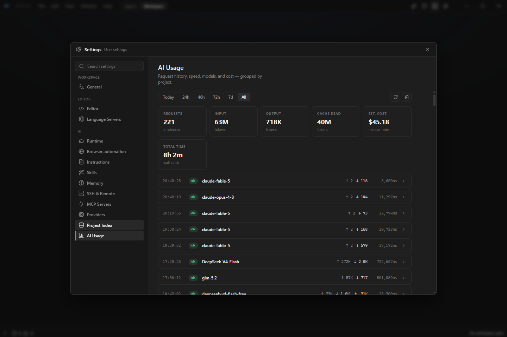

<p align="center">
  
</p>

<h1 align="center">Lux IDE</h1>

<p align="center">
  <b>The AI-native desktop IDE with a real Rust engine.</b><br>
  An autonomous coding agent with 45+ native tools, a tree-sitter code graph, persistent project memory,<br>
  parallel subagents, and built-in web research — inside a fast, polished editor. No Electron. No cloud lock-in.
</p>

<p align="center">
  <a href="https://github.com/GofMan5/lux-ide/releases/latest"></a>
  <a href="https://github.com/GofMan5/lux-ide/releases"></a>
  <a href="https://github.com/GofMan5/lux-ide/actions/workflows/ci.yml"></a>
  <a href="LICENSE"></a>
  <a href="https://github.com/GofMan5/lux-ide/stargazers"></a>
</p>

<p align="center">
  
  
  
  
  
</p>

<p align="center">
  <a href="https://github.com/GofMan5/lux-ide/releases/latest"><b>⬇ Download for Windows</b></a>
  ·
  <a href="#-the-ai-agent">AI Agent</a>
  ·
  <a href="#-editor--workbench">Editor</a>
  ·
  <a href="#-trust--security">Security</a>
  ·
  <a href="#%EF%B8%8F-architecture">Architecture</a>
  ·
  <a href="#-support-the-project">Donate</a>
  ·
  <a href="https://t.me/lux_ide">Telegram</a>
</p>

---


**Lux IDE** is an open-source, Cursor-class desktop IDE where the heavy lifting — filesystem, search, Git, LSP, terminal PTY, **and the entire AI agent loop** — runs in native Rust behind typed IPC, with a React + Monaco workbench on top. The agent isn't a sidebar plugin bolted onto an editor: it is a first-class product surface that inspects your code through a symbol graph, edits with checkpoints and rollback, verifies its own work, and streams every shell command it runs into a live terminal tab you can watch.

> ⚡ **Install once, stay current** — releases ship with a signed auto-updater. 19 releases landed in the first 16 days.

> 🎁 **Free models built in** — a curated set of models ships with Lux IDE at no cost. No API key, no card: link your Telegram once (1 account = your own daily/weekly limits) and start coding. Bring your own key any time for the full 35+ provider catalog.

## ✨ Why Lux

| | Lux IDE | The usual suspects |
|---|---|---|
| 🦀 **Engine** | Filesystem, search, Git, LSP, PTY, DAP **and the agent runtime** are native Rust crates (~40k lines, ~700 unit tests) behind compile-time-typed IPC | Electron forks running the editor *and* the agent in Node |
| 🕸 **Code understanding** | Tree-sitter **code graph** — the agent queries definitions, callers, callees, and blast radius instantly and exactly, with incremental updates on save | Embedding retrieval and blind grepping |
| 🧠 **Memory** | Per-project **SQLite + FTS5 memory** with a knowledge graph (supersedes/extends/contradicts relations), rank fusion, and recency decay — local, inspectable, survives restarts | Context resets every session, or lives in someone else's cloud |
| 🤖 **Agent execution** | Native Rust turn loop, parallel read-only tool fan-out, up to 4 **parallel subagents** with a shared message board, prompt caching, context compaction | Single-threaded chat loops |
| 🌐 **Web research** | Built-in multi-query research engine: query expansion, cross-engine merge, corpus reranking, canonical-URL dedup, inline `[1]` citations | One-shot search wrapper, if anything |
| 🔌 **Providers** | **Free models built in** (no key — link Telegram once, 1 account = your own limits) **+ 35+ BYO-key presets** — OpenAI, Anthropic, Google, DeepSeek, Groq, OpenRouter, Ollama, LM Studio… Your keys go straight from the Rust client to the provider | Proxied billing and a fixed model list |
| 🔒 **Privacy** | **Zero listening ports** by default, stdio-first transports, all indexing/search/graph 100% local, SecretGuard redaction | Agent traffic routed through vendor cloud |
| 💸 **Price** | Free, Apache-2.0, no telemetry surprises, no paywalled features | Subscription |

## 🤖 The AI Agent

Four modes — **Agent** (autonomous), **Automatic** (autonomous + self-planning, never stops at a plan), **Plan** (read-only, presents a structured plan for approval), **Ask** (explain-only) — driving **45+ native tools**:

| Category | Tools & standout capabilities |
|---|---|
| 📝 Files | Pageable `Read`, exact `StrReplace` (CRLF-tolerant, idempotent), atomic multi-file `PatchEngine` with all-or-nothing rollback, structured `InspectFile` for xlsx/pdf/docx/sqlite/zip/ipynb/media |
| 🔎 Search & context | `Grep`, `Glob`, `SemanticSearch`, LSP-powered `SymbolContext`, `RelatedFiles`, `RepoMap`, ranked `ContextBudgeter` under an explicit char budget |
| 🕸 Code graph | `CodeGraphDefinition` / `Callers` / `Callees` / `Explain` (blast radius) / `Overview` (communities, god nodes) — precomputed, instant, exact |
| 🖥 Terminal | `Shell` with background jobs and 3-tier safety classification (catastrophic commands are refused even when hidden inside `$()` or compound chains), live output mirrored to a read-only **"Lux AI" terminal tab** |
| 🌿 Git | `GitContext`, `ReviewDiff` quality gate, `ImpactAnalysis`, `SecretGuard` secret scanner with auto-redaction |
| 🌐 Web | `WebFetch` (SSRF-guarded, IP-pinned DNS), `WebResearch` (deep mode: query expansion + link crawl, up to 15 sources), `MultiWebResearch` (up to 6 concurrent queries, 20 merged sources, per-source citations) |
| 🧠 Memory & skills | `RecallMemory` / `RememberMemory` / `RelateMemories` (knowledge-graph edges with confidence), `ListSkills` / `UseSkill` for vetted SKILL.md playbooks |
| 🕹 Browser | Full agent-browser automation: accessibility snapshots, actions by @ref, screenshots, isolated Chromium sessions |
| 🔗 Extensibility | `McpManage` — the agent installs and connects **MCP servers live**, mid-conversation, and uses their tools next round |
| 👥 Orchestration | `Task` subagents (explorer / code-reviewer / test-runner / general) running in parallel with a topic-scoped `AgentMessage` board; read-only reviewers are permission-fenced by construction |
| 🛟 Safety | `Checkpoint` create/diff/restore, per-turn edit review bar, `AskUser` with rendered HTML previews, `PresentPlan` structured planning |

Under the hood: the turn loop batches independent read-only calls concurrently, attaches Anthropic prompt-cache breakpoints so long sessions re-read the conversation from cache, and compacts context with a head+tail transcript window so neither the original task nor the latest state is lost. A global file-edit lock keeps parallel subagents from ever corrupting a write.


## 📝 Editor & Workbench

- **Monaco editor** with split groups, tab management, dirty-close guards, chord keybindings (`Ctrl+M Ctrl+\`), font zoom, minimap, ligatures.
- **LSP, fully wired**: hover, go-to-definition, references, rename, code actions, completion, signature help, inlay hints, semantic tokens, folding, formatting.
- **Zero-config language servers** — TypeScript/JS, Python, Rust, Go, C/C++ (clangd), Lua, JSON, HTML/CSS, YAML, Bash auto-install into a managed directory, with Node/Rust/Python/Go runtimes provisioned on demand (checksums verified, live progress).
- **Integrated terminal** on a Rust PTY: multiple sessions, 10k scrollback, plus the read-only **Lux AI** tab mirroring the agent's shell in real time.
- **Workspace search & replace** — regex, case, whole-word, include/exclude globs, bulk or per-hit replace across the project.
- **Git panel** — branches (switch/create), stage/unstage/discard, commit, per-file diff viewer.
- **Structured previews** — open xlsx, PDF, docx, SQLite, archives, Jupyter notebooks, images, audio, and video directly; Mermaid diagrams render live.
- **Explorer that scales** — virtualized tree for monorepos, external drag-drop file import, inline create/rename, git status decorations.
- **Polish everywhere** — command palette, keybinding profiles, system-font pickers, EN/RU localization (~1,800 strings each), voice input, vision attachments (smart WebP/PNG per provider), Codex-style update toast with live speed.

## 🔒 Trust & Security

Security posture is documented, enforced in code, and locked by regression tests:

- **Zero listening ports** by default — UI↔engine is native IPC; LSP, DAP, and MCP ride child-process stdio. The policy ladder for anything new is written down in [local channels](docs/architecture/local-channels.md).
- **Approval gates with deny-beats-everything semantics** — a declarative `allow/deny/ask` rule engine (deny > ask > allow) evaluated in trusted Rust, not the renderer. Deny rules fire even inside compound shell commands (`ls && rm -rf /`), and 13 dedicated regression tests lock the precedence order.
- **Workspace jail** — every raw FS command resolves through a canonicalizing path guard; the agent cannot touch files outside the open workspace.
- **SSRF-proof web tools** — the model can never disable the private-network guard; DNS is resolved once, screened (private ranges, loopback, CGNAT, IPv4-mapped-IPv6), and pinned.
- **SecretGuard** — API keys, JWTs, PEM blocks, and connection strings are scanned and redacted in shell output, diffs, and summaries before they reach the chat or logs.
- **Battle-tested** — an 86-agent adversarial audit produced 54 confirmed findings; every critical and high was fixed and regression-tested (see [SECURITY.md](SECURITY.md)).
- **Signed updates** — updater artifacts are Ed25519-signed and verified against a pinned public key before applying.

## 📸 Screenshots

| Agent browser automation settings | AI usage & cost tracking |
| --- | --- |
|  |  |

| Agent workspace | Welcome screen |
| --- | --- |
|  |  |

## 📥 Installation

**Windows:** grab the installer from the [latest release](https://github.com/GofMan5/lux-ide/releases/latest). After the first launch:

- `lux .` works from any terminal — Lux registers a `lux` command on your user PATH (no admin rights needed).
- Right-click any folder in Explorer → **Open with Lux IDE**.
- Auto-update keeps you on the newest release.

**Build from source:**

```powershell
# Prerequisites: Rust stable, Node.js 22+, pnpm 10+, Tauri 2 platform deps
pnpm install
pnpm dev            # desktop dev build
pnpm tauri:build    # production bundle
```

`pnpm dev:web` runs a browser-only preview for UI iteration; production behavior requires the Tauri desktop runtime.

## 🏛️ Architecture

One Tauri 2 shell + a Cargo workspace of focused crates (~40k lines of Rust) behind typed IPC — every DTO derives `ts-rs`, so the TypeScript types are generated from the Rust structs, never hand-maintained. 190+ Tauri commands wire the engine to the workbench.

```text
apps/desktop          Tauri 2 shell, React workbench, Monaco, xterm.js

crates/lux-core       shared DTOs, typed errors/events, global scan-concurrency budget
crates/lux-workspace  workspace identity (stable 128-bit IDs) and lifecycle
crates/lux-fs         parallel ignore-aware scanning, watching, mutations (200k-entry crawl cap)
crates/lux-editor     document store and open/edit/save lifecycle
crates/lux-search     parallel content search — ranked, low-value paths deprioritized
crates/lux-terminal   PTY service (portable-pty), smart shell resolution
crates/lux-git        system-git plumbing: NUL-safe parsing, 30s hang-proof timeouts
crates/lux-ssh        non-interactive OpenSSH driver (inherits your keys and config)
crates/lux-settings   persisted settings, recents, keybinding profiles

crates/lux-lsp        LSP client: framing, typed requests, zero-config server discovery
crates/lux-dap        debug adapter discovery, DAP transport, launch.json parsing
crates/lux-file-intel xlsx/pdf/docx/sqlite/archive/notebook extraction (zip-bomb guarded)
crates/lux-codegraph  tree-sitter code graph: Rust/TS/Python, incremental updates,
                      on-disk parse cache, communities, centrality, cycle detection

crates/lux-memory     per-project agent memory: SQLite + FTS5, rank fusion,
                      retention tiers, knowledge-graph relations
crates/lux-skills     discoverable SKILL.md modules (project scope wins over global)
crates/lux-research   web research core: query building, parsing, lexical reranking

crates/lux-extensions WASM extension host on wasmtime (fuel budgets, hard sandboxing)
crates/lux-bench      CI performance gate: list ≤1.5s, search ≤2s, events ≤80ms
```

Deep dives: [Rust-first boundaries](docs/architecture/rust-first-boundaries.md) · [Milestones](docs/architecture/milestones.md) · [Local channels & security posture](docs/architecture/local-channels.md)

## ✅ Quality Gates

Every push and every release tag runs the same bar — releases take no shortcuts:

```powershell
cargo fmt --all --check
cargo clippy --workspace --all-targets   # -D warnings
cargo test --workspace                   # ~700 unit tests
cargo run -p lux-bench -- --assert       # hard perf thresholds
pnpm typecheck && pnpm build             # + vitest, AI-pipeline verifies, bundle budgets
```

Bundle budgets keep the entry chunk under 300 KB and every eager chunk under 450 KB — heavy libraries (Mermaid, graph layouts) load lazily, only when a preview actually opens.

## 🗺 Roadmap

- **Inline AI ghost-text completion** — the flagship next feature.
- Full DAP debug session execution from detected configurations.
- WASM extension host with a stable public contribution API.
- Agent-eval harness gating releases; unified multi-file changeset review.
- Cold-start and workspace-open latency budgets in CI.

## 💖 Support the Project

Lux IDE is free and open source, built by one developer shipping at ~1 release/day. If it saves you time, fuel the roadmap:

<!-- donations:start -->
| Platform | Link |
|---|---|
| 🎁 **DonationAlerts** | [donationalerts.com/r/gofman5](https://www.donationalerts.com/r/gofman5) |

**Crypto:**

| Network | Address |
|---|---|
| ₿ Bitcoin (BTC) | `bc1qs5yshuvaxdw7cg9q8602ts9jvc3csh9cyc4q3q` |
| Ξ Ethereum (ETH / ERC-20) | `0xbbD9c40FfaCDf344D23293887B613A870F6497FB` |
| ₮ USDT (TRC-20) | `TUitn7ovNfC1N8HaryDecGc8RxsZDqPB9k` |
| ◎ Solana (SOL) | `D3YBBhbrCiGtEyQY5rR658yZX98qQau5s6Ae7seFBKov` |
| 💎 TON | `UQB7Sn0sWrByEwZaZXLDv99UiyqkQraZdFZ02f8RJ--qlmdN` |
| Ł Litecoin (LTC) | `ltc1qgpcmcfc0nntj3nhg0x05m3fkgm6tsv3d5r8zqq` |
<!-- donations:end -->

⭐ **Can't donate? Star the repo** — it's the single biggest boost for an open-source project's visibility.

## 🤝 Contributing

Read [CONTRIBUTING.md](CONTRIBUTING.md) first. Good contributions keep Rust as the product engine, preserve typed IPC, avoid placeholder UX, and include focused tests. New here? Start with docs, reproducible bugs, UI polish, Rust unit tests, or LSP/DAP adapters.

## 💬 Community

- Telegram: [t.me/lux_ide](https://t.me/lux_ide)
- Issues & feature requests: [GitHub Issues](https://github.com/GofMan5/lux-ide/issues)

## 📄 License

Apache License 2.0 — see [LICENSE](LICENSE) and [NOTICE](NOTICE).

---

<p align="center">
  <sub><b>Lux IDE</b> — open-source AI code editor · Cursor alternative · Rust IDE · Tauri desktop app · autonomous coding agent · AI pair programmer · code graph · local-first AI development</sub>
</p>
